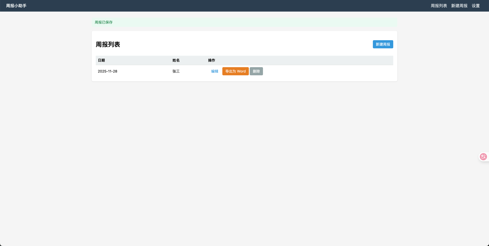

# Weekly Report 周报系统

一个本地运行的简易周报管理工具，使用 **Python + Flask** 开发。



## 功能
- 新建 / 编辑 / 删除周报
- Word（.docx）导出（基于用户模板）
- 自动打开浏览器
- 本地 SQLite 存储

## 字段
- `NAME`（姓名）
- `DATE`（日期）
- `SUMMARY`（本周总结，Markdown）
- `PLAN`（下周计划，Markdown）

## 安装和运行

```bash
pip install flask sqlalchemy python-docx
python app.py
```

## Word 模板说明

你可以上传一个 .docx 模板并在其中使用以下占位符：

```text
{{NAME}}
{{DATE}}
{{SUMMARY}}
{{PLAN}}
```

系统会自动替换并导出为新文档。

## 项目结构（简版）

```csharp
weekly-report/
│── app.py                 # 主程序
│── weekly_reports.db      # 本地数据库（首次运行自动生成）
│── data/                  # Word 模板 & 导出文件
│── templates/             # 前端模板
│   ├── base.html
│   ├── list.html
│   ├── form.html
│   └── settings.html
│── static/
│   └── favicon.ico        # 网页图标（可自定义）
└── README.md
```